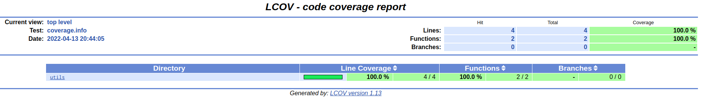

# 说明

This is a cmake test for GTest. 可以一键执行shell脚本统计代码覆盖率。

演示GTest集成与使用。

# 使用方式

mkdir build

cd build

cmake ..

开Debug模式命令

cmake .. -DCMAKE_BUILD_TYPE="Debug" -DCMAKE_DEBUG_ASAN=ON

make -j16

# 运行

./bin/main

./bin/func_test

./code_coverage.sh 可以统计单元测试的代码覆盖率，结果生成在GTestDemo/build/coverage/coverage_report/index.html，如下图：

	

# 清理

make clean

# 参考文档

Cmake add_test

[https://blog.csdn.net/sun_ashe/article/details/104527591/]()

[https://cmake.org/cmake/help/v3.12/command/file.html]()

[https://blog.csdn.net/bytxl/article/details/48287499]()

代码覆盖测试

[https://paul.pub/gtest-and-coverage/]()

[https://www.codeleading.com/article/93614362313/]()
